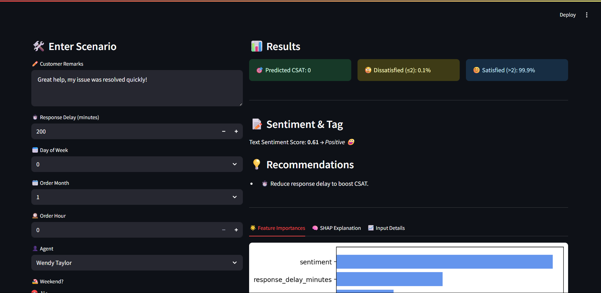
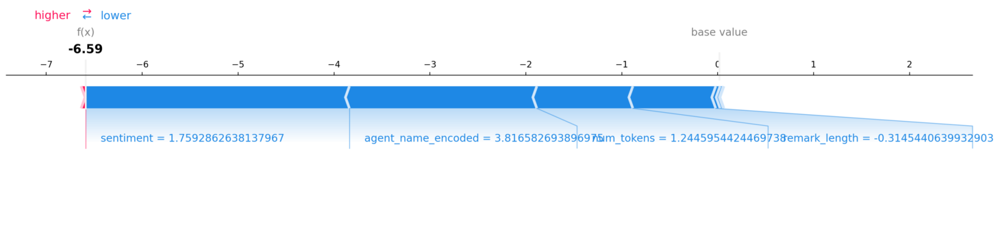
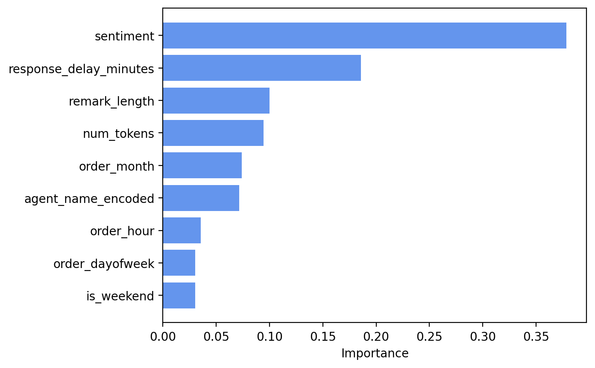

📊 CSAT Score Prediction

This project predicts customer satisfaction (CSAT) scores using machine learning and text sentiment analysis.
It combines operational data (like response delay, order time, agent info) and textual data (customer remarks) to help businesses proactively understand and improve customer experience.

---

🧠 Objective

To predict whether a ticket will receive a low CSAT score (≤2, indicating dissatisfaction) or a satisfactory score (>2), using historical ticket and chat data.

---

📂 Project Structure
```
csat-prediction-project/
├── images/
│   ├── chart.png
│   ├── first.png
│   ├── shap.png
|
├── models/
│   ├── xgb.pkl
│   ├── scaler.pkl
│   ├── agent_freq.pkl
│   └── feature_list.json
|
├── Customer_support_data.csv
├── code.ipynb
├── app.py
└── README.md
```

---

📁 Dataset

  Source: Internal / hypothetical support ticket dataset
  
  Contains:
  
  - Ticket details: response delay, order date/time, agent shift, channel, category
  
  - Customer remarks (text)
  
  - Target variable: CSAT score (1–5)

---

🔍 Features Used

  Operational features:
  
  - response_delay_minutes, order_dayofweek, order_month, order_hour
  
  - agent_name_encoded (frequency encoding)
  
  - is_weekend
  
  Textual features:
  
  - remark_length (number of words)
  
  - num_tokens (tokens from customer remarks)
  
  - sentiment score (from TextBlob)

---

⚙️ Workflow

  ✅ Data cleaning & preprocessing
  
  ✅ Feature engineering (sentiment score, time-based buckets)
  
  ✅ Encoding categorical variables
  
  ✅ Handling class imbalance with SMOTE
  
  ✅ Feature selection using RandomForestClassifier
  
  ✅ Scaling numerical features
  
  ✅ Training multiple models
  
  ✅ Hyperparameter tuning with GridSearchCV
  
  ✅ Model interpretation with SHAP
  
  ✅ WebApp using Streamlit

---

🤖 Models Used

  - Logistic Regression
  
  - Random Forest
  
  - Decision Tree
  
  - XGBoost (final chosen model)

---

📐 Evaluation Metrics

  - Accuracy
  
  - Precision
  
  - Recall
  
  - F1-score

  - SHAP values for explainability

---


📈 Model Performance

| Model                | Accuracy | Precision | Recall | F1-Score |
|---------------------|:--------:|:---------:|:------:|:-------:|
| Logistic Regression | 0.731    | 0.828     | 0.731  | 0.764   |
| Random Forest       | 0.759    | 0.830     | 0.759  | 0.785   |
| Decision Tree       | 0.777    | 0.801     | 0.777  | 0.788   |
| **XGBoost (final)** | **0.792**| **0.822** | **0.792**| **0.804** |

---

🛠️ Technologies Used

  - Python (pandas, numpy)
  
  - scikit-learn
  
  - XGBoost
  
  - imbalanced-learn (SMOTE)

  - TextBlob (sentiment analysis)
  
  - SHAP (explainable AI)
  
  - Streamlit (web app)
  
  - Matplotlib & Seaborn (visualization)

---

🌐 Streamlit Web App

  A user-friendly app to:
  
  - 📋 Enter ticket details & customer remarks
  
  - 🔍 Auto-extract text features (length, tokens, sentiment)
  
  - 🎯 Predict likelihood of dissatisfaction
  
  - 🌟 Show feature importance & SHAP explanation
  
  - 🏷️ Display customer tags & recommendations

---

📊 Streamlit App Overview


  **Demo Input**
  
  
  

  **Shap Analysis Chart**
  
  


  **Feature Importance Chart**
  
  

---

🚀 Future Work

  Allow prediction from just a ticket/order ID (auto-fill all fields)
  
  Improve sentiment analysis for nuanced understanding
